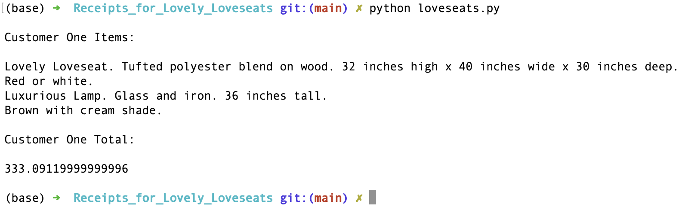

## Receipts for Lovely Loveseats

### What does it do?
> Prints the recipes of a customer of a nice seats shop :)

### How was it done?
> Using Emacs and the CLI ( for working "muscles" practice)

### Why ?
> Chose to use CLI and Emacs to train myself to become more comfortable with them.
> Side unexpected bonus is i learned how to upload a pic to GitHub from terminal ! Neat :)

### Renders like this:
> 
